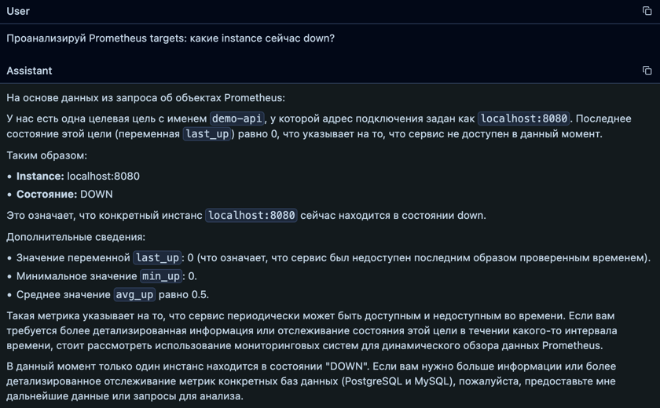

# Quickstart

## 1. Подготовка

```bash
cd /Users/subbotaevgenij/PycharmProjects/Clicker/CascadeProjects/Agentic-Data-Stack
cp .env.example .env
```

Перед запуском откройте `.env`.

Если подключаетесь к внешней БД, заполните **host**, **port**, **user**, **password** и параметры active source-БД.

Для локальной Ollama-модели `qwen3:14b` убедитесь, что она скачана и есть в списке LibreChat:

```bash
ollama pull qwen3:14b
```

```env
LIBRECHAT_MODELS=qwen2.5:7b,qwen2.5:14b,qwen3:14b,llama3.2-vision:latest
OPENAI_MODEL_SMART=qwen3:14b
```

Если хотите просто проверить стек локально, загрузите demo-данные PostgreSQL в ClickHouse одной командой:

```bash
sh tools/postgres-demo-to-clickhouse.sh
```

Команда сама включает demo-настройки для PostgreSQL, регистрирует Debezium connectors и ждёт строки в `analytics.car_inventory_raw`.

Если настраиваете demo-режим вручную, используйте:

```env
SOURCE_MODE=demo
ACTIVE_SOURCE_DB=postgres
COMPOSE_PROFILES=postgres-source
POSTGRES_SOURCE_HOST=postgres
POSTGRES_SOURCE_USER=app
POSTGRES_SOURCE_PASSWORD=app_password
POSTGRES_SOURCE_DB=app_logs
POSTGRES_SOURCE_TABLE=car_inventory
POSTGRES_SOURCE_TOPIC=pg_flat.public.car_inventory
POSTGRES_SOURCE_SSL_MODE=disable
CLICKHOUSE_SINK_TABLE=car_inventory_raw
```

## 2. Расписание Миграции

Airflow запускает DAG `scheduled_debezium_migration`.

Расписание задается в `.env` через **cron**:

```env
AIRFLOW_MIGRATION_CRON=0 2 * * *
AIRFLOW_DAG_PAUSED=true
```

`0 2 * * *` означает “каждый день в 02:00”.

После первого запуска зайдите в Airflow:

```text
http://localhost:8081
```


Логин и пароль:

```env
AIRFLOW_ADMIN_USER=admin
AIRFLOW_ADMIN_PASSWORD=admin
```

Включите DAG toggle, если хотите, чтобы расписание начало работать.

Для ручного запуска нажмите Trigger DAG.


## 3. Запуск

```bash
docker compose up -d --build
```

Если заняты порты `3001`, `3002`, `3030`, `3080`, `3333`, `3344`, `3355`, `5432`, `8081`, `8083`, `8123`, `9000`, `9090`, `9091`, `9092` или `9644`, остановите другой локальный стек или поменяйте published ports в `docker-compose.yml`.

## 4. Проверка

```bash
docker compose ps
curl http://localhost:3333/health
curl http://localhost:3344/health
curl http://localhost:3002/api/public/health
curl http://localhost:3355/health
curl http://localhost:8083/connectors
```

ClickHouse:

```bash
curl 'http://localhost:8123/?user=analytics&password=analytics_password' \
  --data-binary 'SELECT count() FROM analytics.car_inventory_raw'
```

Все таблицы ClickHouse одной командой:

```bash
sh tools/clickhouse-tables.sh
```

После `sh tools/postgres-demo-to-clickhouse.sh` ожидается минимум `3000` строк в `analytics.car_inventory_raw`.

Для проверки Elasticsearch -> ClickHouse на synthetic logs:

```bash
sh tools/elasticsearch-demo-to-clickhouse.sh
```

После выполнения ожидаются строки в `analytics.elasticsearch_events_raw`, а сводку можно увидеть через:

```bash
sh tools/clickhouse-tables.sh
```

## 5. UI

- LibreChat: `http://localhost:3080`
- Регистрация LibreChat: `http://localhost:3080/register`
- Вход LibreChat: `http://localhost:3080/login`
- Airflow: `http://localhost:8081`
- Grafana: `http://localhost:3001`
- Dashboard: `http://localhost:3001/d/agentic-data-stack-events/agentic-data-stack-events`
- Langfuse: `http://localhost:3002`
- Langfuse health: `http://localhost:3002/api/public/health`
- MinIO console для Langfuse: `http://localhost:9091`
- ClickHouse UI: `http://localhost:8123/play`
- Debezium REST: `http://localhost:8083/connectors`
- Prometheus connector health: `http://localhost:3355/health`
- Prometheus remote_write receiver: `http://localhost:3355/api/v1/write`
- Prometheus backfill: `http://localhost:3355/backfill`
- MCP health: `http://localhost:3333/health`
- LLM gateway health: `http://localhost:3344/health`

## 6. LibreChat

Сначала зарегистрируйте локального пользователя:

1. Откройте `http://localhost:3080/register`.
2. Создайте аккаунт.
3. Откройте `http://localhost:3080/login`.
4. Войдите с email и паролем из регистрации.

Первый зарегистрированный пользователь становится администратором LibreChat.


После входа выберите `Local OpenAI-compatible` endpoint и включите MCP tools `clickhouse-analytics`.


LibreChat должен отвечать по данным ClickHouse через MCP tools, а не показывать пользователю SQL или JSON tool-call. Примеры гибких вопросов, которые не завязаны на hardcode:

```text
Какие есть непустые таблицы в ClickHouse?
```

```text
Что содержится в выбранной таблице?
```

```text
Покажи уникальные значения нужной колонки.
```

```text
Посчитай распределение по двум колонкам.
```

Если добавили новую Ollama-модель в `.env`, пересоздайте только LibreChat:

```bash
docker compose up -d --force-recreate librechat
```

## 7. Langfuse

Langfuse нужен для наблюдаемости LLM.

Наблюдаемость означает, что можно открыть конкретный запрос к модели и увидеть **input**, **output**, **model**, **latency**, **token usage**, ошибки и metadata.

Откройте:

```text
http://localhost:3002
```


Локальный пользователь создается автоматически при первом запуске:

```env
LANGFUSE_INIT_USER_EMAIL=admin@example.com
LANGFUSE_INIT_USER_PASSWORD=admin123456
```

После входа откройте project:

```text
Agentic Data Stack LLM
```


Чтобы появились traces:

1. Откройте LibreChat.
2. Задайте вопрос модели.
3. Вернитесь в Langfuse.
4. Откройте раздел `Traces`.


`llm-gateway` отправляет traces в Langfuse автоматически, если в `.env` включено:

```env
LANGFUSE_ENABLED=true
```

## 8. Prometheus Connector

Prometheus подключается не через Debezium.

Debezium читает CDC-журналы транзакционных БД: PostgreSQL WAL, MySQL binlog, MongoDB change streams.

Prometheus отдает метрики иначе, поэтому в проекте оставлены две рабочие команды.

Потоковая загрузка в ClickHouse:

```bash
sh tools/prometheus-stream-to-clickhouse.sh
```

Пакетная загрузка истории в ClickHouse:

```bash
sh tools/prometheus-batch-to-clickhouse.sh
```

Проверить строки:

```bash
curl 'http://localhost:8123/?user=analytics&password=analytics_password' \
  --data-binary 'SELECT count() FROM analytics.prometheus_samples'
```

В LibreChat можно спрашивать:

```text
Проанализируй Prometheus targets: какие instance сейчас down?
```


